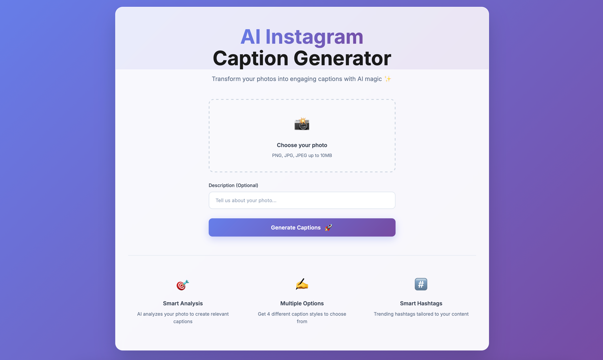
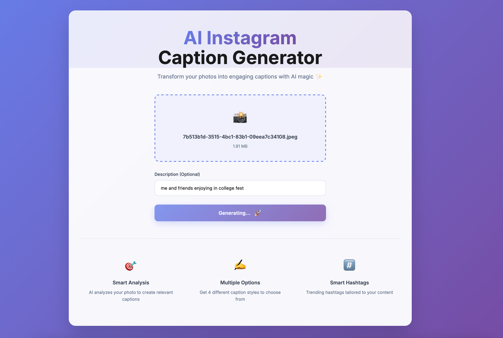
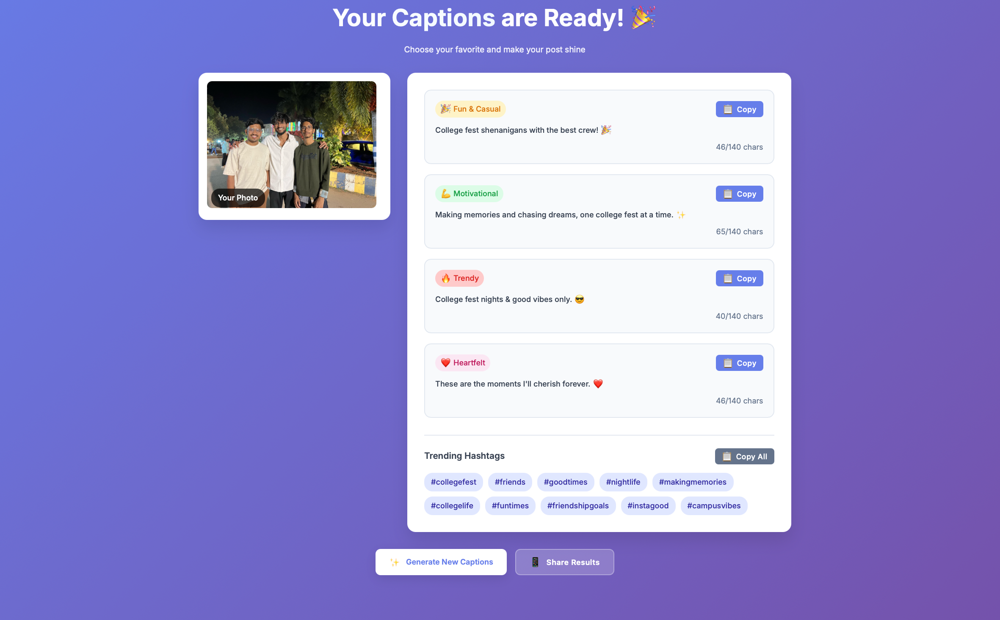

# AI Instagram Caption Generator 🚀

Create catchy Instagram captions in seconds using AI and the Gemini API!

## Description
This Flask web app transforms your images or short descriptions into 3–4 creative Instagram captions instantly. Whether you want funny, inspirational, or romantic captions, this app has you covered. Powered by the **Gemini API**, it generates smart, context-aware captions perfect for boosting engagement on social media.

## Features
- Generate multiple captions from an image or text description
- Captions categorized by style (Funny, Inspirational, Romantic, etc.)
- Fast, easy-to-use, and interactive
- Built with Flask + Gemini API for AI-powered caption generation
- Resume-ready project for your portfolio

## Demo
Try it locally and see the magic!  

## Installation

1. Clone the repository:
```bash
git clone https://github.com/MohammedAthiq/ai-instagram-caption-generator.git
cd ai-instagram-caption-generator
```

2. Create a virtual environment and activate it:
```bash
python3 -m venv venv
source venv/bin/activate   # Mac/Linux
venv\Scripts\activate      # Windows
```

3. Install dependencies:
```bash
pip install -r requirements.txt
```

4. Set environment variables:
```bash
export GEMINI_API_KEY=<your-Gemini-API-key>   # Mac/Linux
set GEMINI_API_KEY=<your-Gemini-API-key>      # Windows
```

5. Run the app locally:
```bash
python app.py
```

Open [http://127.0.0.1:5000](http://127.0.0.1:5000) in your browser.

## Project Structure
```
ai-instagram-caption-generator/
│
├── app.py             # Main Flask app
├── requirements.txt   # Python dependencies
├── templates/         # HTML templates
├── static/            # CSS/JS files
└── README.md
```
## Screenshots






## License
MIT License
